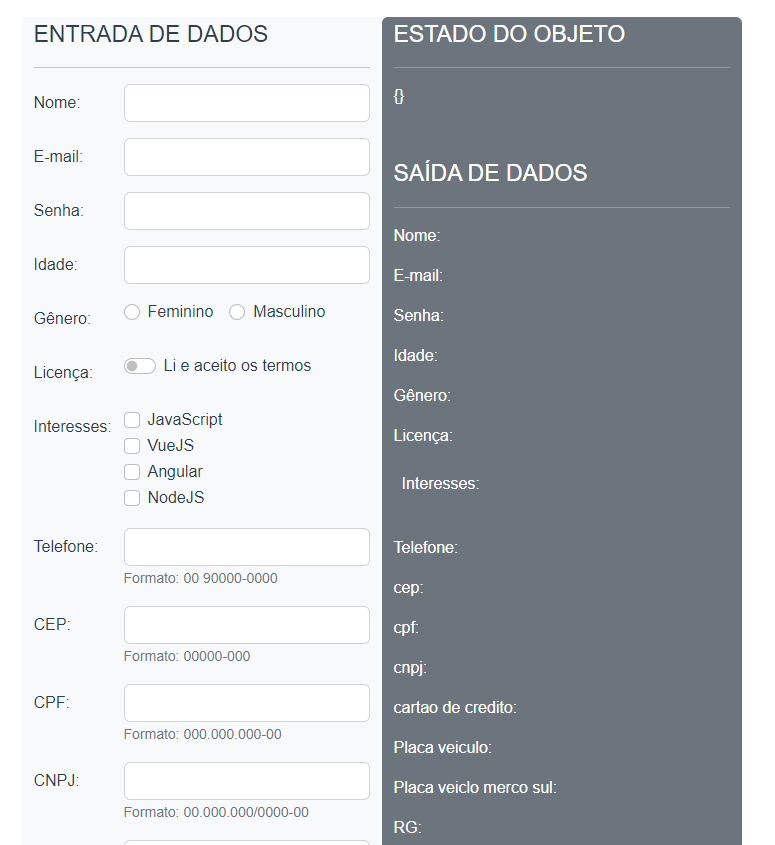

#
<table align="center">
    <tr>
        <td>
            
        </td>
    </tr>

</table>

## 🏷️ Sobre 
Site para treinar todas as funcionalidades de um form com vueJS
<p align="left">Confira a aplicação: <a href="https://formulario-vue.vercel.app/" target="_blank"> Teste o formulário <a/></p>

---

## 🛠️ Tecnologias e serviços utilizados
Foram utilizadas as seguintes tecnologias para desenvolver a aplicação "Form" :

- [Vue.JS](https://vuejs.org/)
- [BootStrap](https://getbootstrap.com/)


## 🗂️ Como baixar e iniciar o projeto 

```bash

    #clonar o projeto
    $ git clone https://github.com/SamuelPereiraBrandao/Formulario-Vue.git

    #entrar no diretório
    $ cd Projeto-Vagas-Vue-main

    #instalar as dependências
    $ npm install
    $ npm i moment@2.29.1
    $ npm install maska

    #iniciar a aplicação
    $ npm run serve

```

## Autor
### 👤 Samuel Pereira Brandão
<table align="center">
  <tr align="center">
    <td align="center">
      <a href="https://github.com/SamuelPereiraBrandao">
        <br>
        <sub>
          <b>Samuel Pereira Brandão</b>
        </sub>
      </a>
    </td>
    
</table>

---
## 📝 Licença
Copyright © 2022 [@samuelpereirabrandao]


---

### Desenvolvido 💜 by Samuel Pereira Brandão

